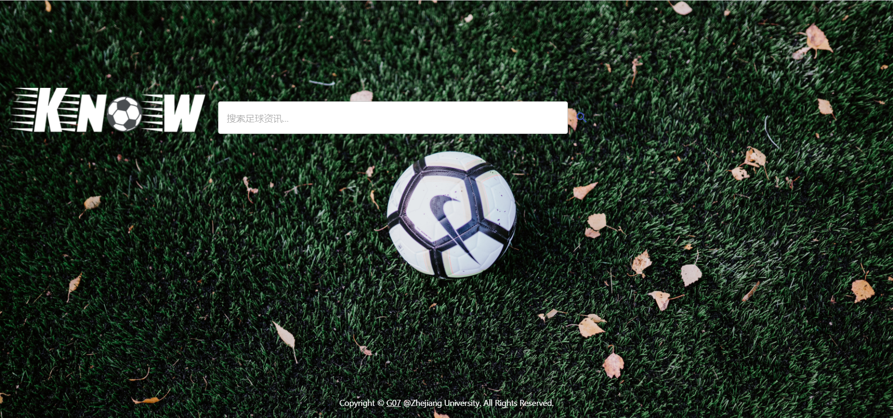
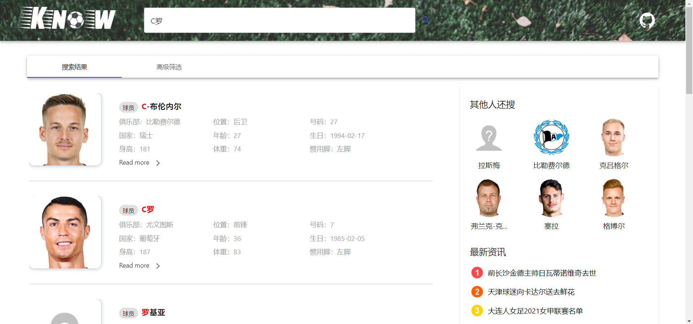
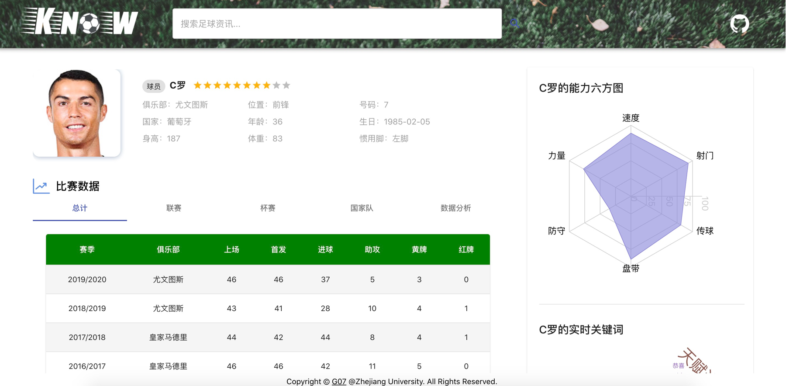
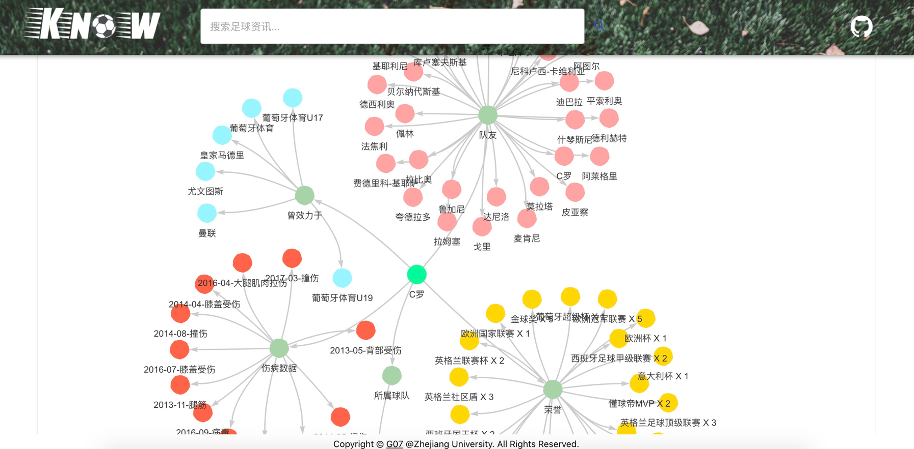
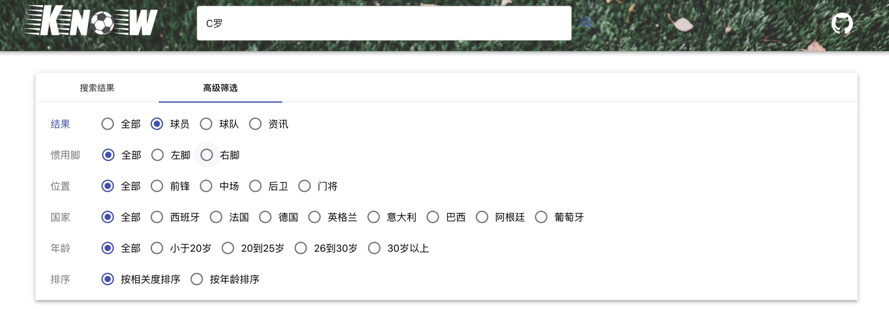

# KnowABall Search Engine

## Introduction

- A football-about vertical search engine for summer term with knowledge graphs and word cloud
- You can retrieve player/team/football news here，and have a look at the detailed information with good visualization

## Development Frameworks

- Front end：React.js + material-ui + React-wordcloud + React-graph-vis
- Back end：Spring Boot + MySQL+Elastic Search+Mybatis + Redis
- Crawler & Data process scripts：Python(Crawl from web --> preprocess --> import to Database & Elastic Search)
- SQL scripts

## Preview

